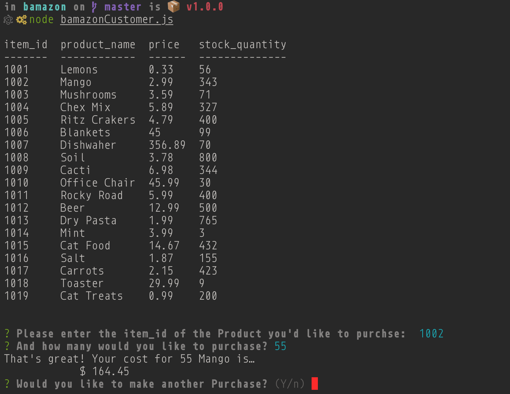
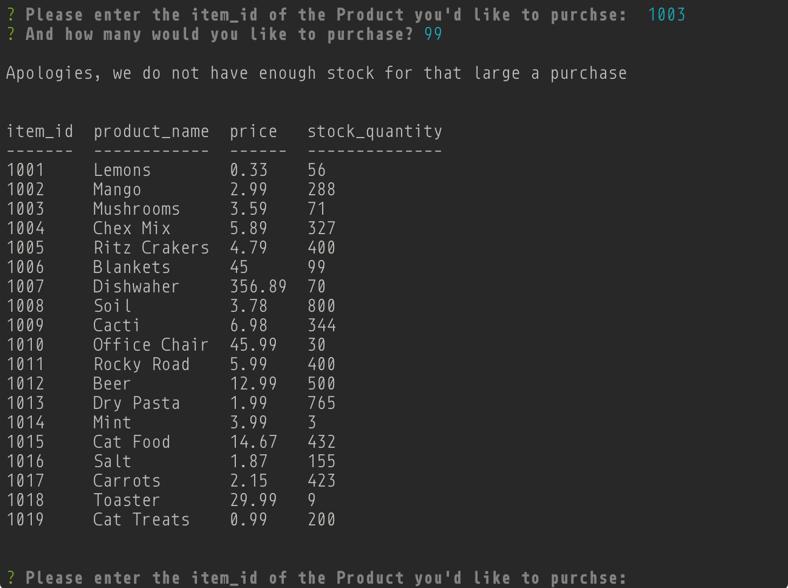
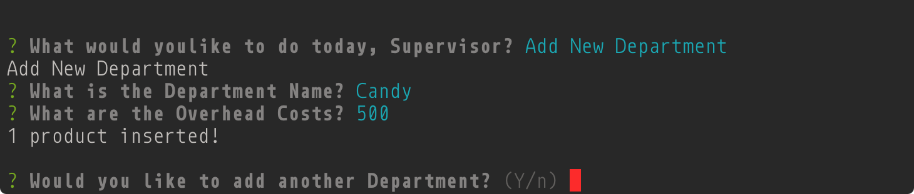

# Welcome to b.amazon

This is a CLI node application for managing an Amazon like store front.

## Priamary Technologies

Node.js &amp; MYSQL

## Run Through

There are 3 Levels of the application: Customers, Managers, and Supervisors.

### [Customer](bamazonCustomer.js)

Customer is asked which product they would like to purchase by entering the item's id.

Customer is then asked how many of that item they would like to purchase. They are then presented with the total cost of thier purchase.

If the customer requests more than the stock allows, they are told so and then asked to start again.

Finally, if the customer desiceds they no longer would like to make any more purchases they are exited from the app.

### [Manager](bamazonManager.js)

Manager is initially presented with a list of the bamazon inventory. Much like the customer view but with additnal info per item, like Department and some sales figures.

The manager can call this view at any time.

The manager can view a table of just the Low Inventory items. In bamazon's case, anythign that has less than 150 item in stock.

The manager can reset the stock of any item.

The manager can also add new products to the store. This department name will show up in Supervisory Sales tables.

### [Supervisor](bamazonSupervisor.js)

To Begin the supervisor is presented with the the sales numbers and profit of individual departments.

The supervisor can call this view at any time.

The supervisor can add additional Departments.

And see those products in the Sales Table.

## Further enhancement

This feels very much like a stepping stone project by design. I'm excited about integrating this base level knowledge in future complex projects. I'm not looking forwad to looking up SQL syntax, but I feel im in for it!
